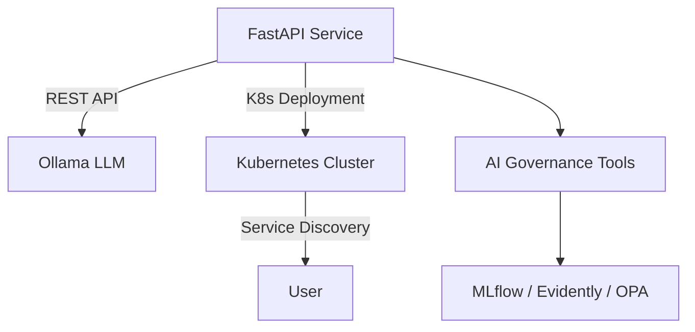

# K8s Ollama FastAPI Demo

This repository demonstrates a simple deployment of **FastAPI** integrated with **Ollama** (LLM serving) on a Kubernetes cluster. It is designed to showcase how AI inference services can be containerized, deployed, and managed in a cloud-native environment.

## 📌 Features
- FastAPI application for AI inference
- Ollama integration for running LLMs
- Kubernetes manifests for deployment
- Example configuration for local development and testing
- Extensible architecture for adding AI governance tools (MLflow, Evidently, OPA)

## 📂 Repository Structure
```plaintext
k8s-ollama-fastapi-demo/
├── app/
│   ├── main.py              # FastAPI application entry point
│   ├── requirements.txt     # Python dependencies
│   └── Dockerfile           # Container definition
├── k8s/
│   ├── deployment.yaml      # Kubernetes Deployment manifest
│   ├── service.yaml         # Kubernetes Service manifest
│   └── configmap.yaml       # Optional configuration
├── .gitignore               # Git ignore file
└── README.md                # Project documentation
```

## 🚀 Getting Started

### 1️⃣ Prerequisites
- Python 3.11+
- Docker
- Kubernetes cluster (Minikube, k3s, or cloud provider)
- kubectl & Helm

### 2️⃣ Install Dependencies
```bash
pip install -r app/requirements.txt
```

### 3️⃣ Run Locally
```bash
uvicorn app.main:app --reload
```

### 4️⃣ Build Docker Image
```bash
docker build -t fastapi-ollama:latest app/
```

### 5️⃣ Load Docker Image into Kubernetes (for Minikube)
```bash
minikube image load fastapi-ollama:latest
```
*(If using a remote registry, push the image and update the deployment manifest accordingly.)*

### 6️⃣ Deploy to Kubernetes
```bash
kubectl apply -f k8s/
```

### 7️⃣ Access the Service
```bash
kubectl port-forward svc/fastapi-ollama-service 8000:80
```
Then open [http://localhost:8000](http://localhost:8000) in your browser.

## 🛠 Architecture


## 📌 Notes
- This is a demo repository for educational purposes.
- Future versions may include Watsonx.ai integration.
- Governance tools (MLflow, Evidently, OPA) will be optional add-ons.

## 🗺 Roadmap
- [ ] Initial FastAPI and Kubernetes deployment
- [ ] Add Ollama inference integration
- [ ] Integrate AI governance tools (MLflow, Evidently, OPA)
- [ ] Create public demo with GitHub Actions CI/CD

---

### Author
**AI Governance Lab**  
Building secure, automated, and governed AI solutions on Kubernetes.